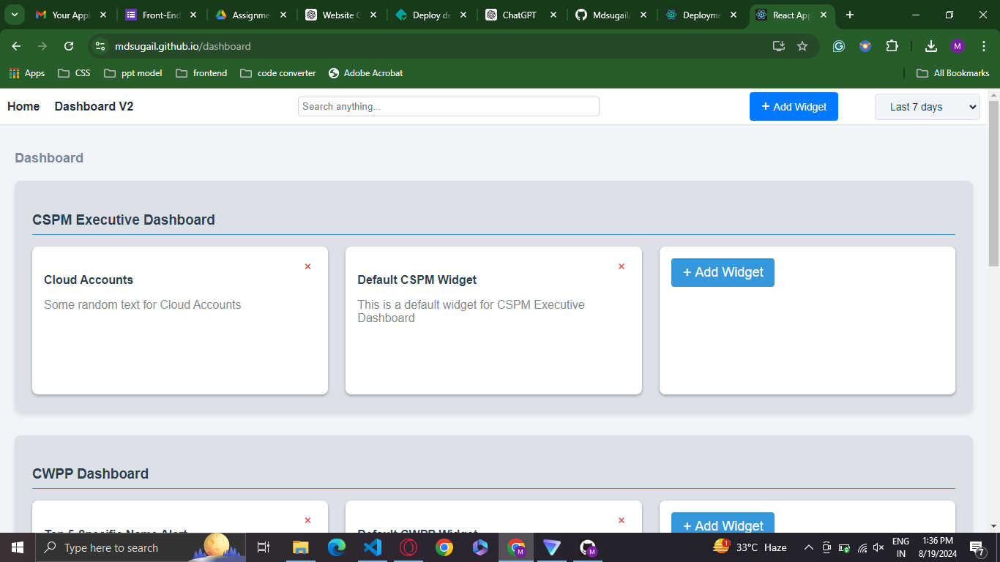

# CNAPP Dashboard

CNAPP Dashboard is a React-based web application that provides a comprehensive view of Cloud Native Application Protection Platform (CNAPP) metrics and insights.

## Features

- Interactive dashboard with customizable widgets
- Multiple categories including CSPM Executive Dashboard, CWPP Dashboard, Registry Scan, and Ticket Security
- Search functionality across all widgets
- Add and remove widgets dynamically
- Responsive design for various screen sizes

## Screenshots

### Home Page

### CNAPP Dashboard

## Getting Started

### Prerequisites

- Node.js (version 12 or higher)
- npm (usually comes with Node.js)

### Installation

1. Clone the repository:

2. Navigate to the project directory:

3. Install dependencies:

4. Start the development server:

5. Open your browser and visit `http://localhost:3000`

## Usage

- Navigate between the Home page and Dashboard using the navigation bar
- Use the search bar in the Dashboard to filter widgets
- Add new widgets using the "Add Widget" button
- Remove widgets by clicking the close icon on each widget

## Technologies Used

- React
- Redux Toolkit
- React Router
- Chart.js
- React ChartJS 2

## Contributing

Contributions are welcome! Please feel free to submit a Pull Request.

## License

This project is licensed under the MIT License.

